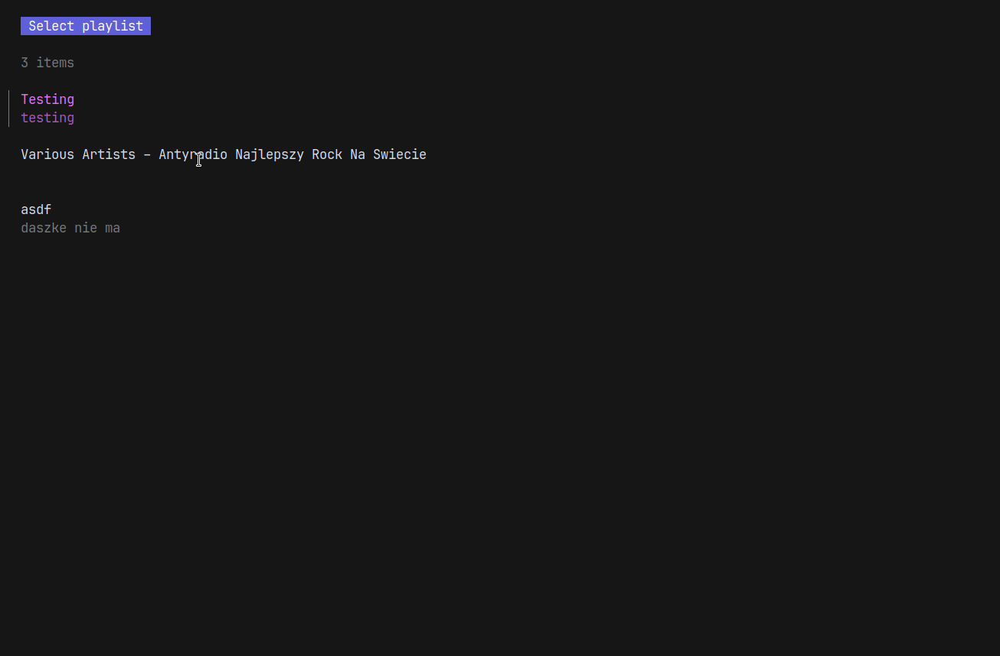

# Spotify Playlist Sorter

I like to keep a custom song order in my Spotify playlists. From time to time my favourite artists 
release a new album. When I add new songs to playlists, I usually want to move them closer to the old songs
so that all tracks from one artists are in a one group together. Of course, you can achieve a similar effect by simply 
sorting the playlist by artist name, but I am proud programmer who wanted to write a program to sort groups of songs by 
artist name while preserving the original order of older tracks.

## Features

* Fetching songs from a playlist and grouping them in groups by artist name
* Sorting playlist by merging groups together

## Instalation

Probably no one will ever visit this page, so I didn't bother preparing executables. If you want to use the
program yourself, simply clone the repository. Firsty you will have to download dependencies by running `go get .`.
After that you can either run the programy by calling `go run .`, or you can try to build and install it with 
`go install` or `go build`. I haven't tried that, so I leave it up to you. Worth mentioning is the requirement to 
install golang virst.

## Usage

Program in interactive. Thanks to _bubbletea_, it supports vim motions and navigation by arrows. To select
playlist/artist/song group press enter, to cancel selection press esc. Below you can see how entire sorting process
looks like.

## Development plans

* Write tests
* Make code bit cleaner

If you have any suggestions, feel free to create an issue. There is a chance that I will look into it.

# License

Project is licensed under MIT License.
